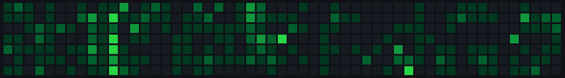

  

    

  

# Hi, I'm Mike 👋

I'm a Junior Fullstack Developer. I've recently completed a Software Development bootcamp with [Northcoders](https://northcoders.com/our-courses/skills-bootcamp-in-software-development) in January 2024!

## Projects

As a part of bootcamp, I have created some portfolio projects to showcase my work. These will be expanded on completion of further projects:

- I've created a News API using Node, Express and PostgreSQL. The repo can be found [here](https://github.com/mikef80/be-nc-news).
- I've created a frontend React app to accompany my News API. The repo can be found [here](https://github.com/mikef80/fe-nc-news).
- I've been a part of a 6-person team that created a React Native app, powered by a MongoDB backend. This was for our final project.
    - The frontend repo can be found [here](https://github.com/mikef80/quotesnap-fe).
    - The backend repo can be foudn [here](https://github.com/mikef80/quotesnap-be).

 

I have been coding for a lot longer than I've been on the bootcamp, so feel free to dig around my repos to see what else I've created.  A couple of earlier projects that I hope to revisit one day are:
- [Colourdle!](https://github.com/mikef80/colourdle) - my Wordle-inspired spinoff!
- [RepoHide](https://github.com/mikef80/hide-github-repos) - a Chrome extention to hide archived repos
- [Shopping Companion PWA](https://github.com/mikef80/lemon-and-jinja) - an installable React-Redux PWA that is a shopping companion app. Designed to be installable, work offline and have persistent storage.
